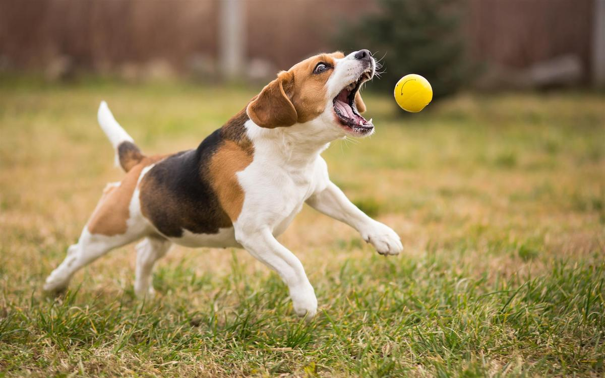
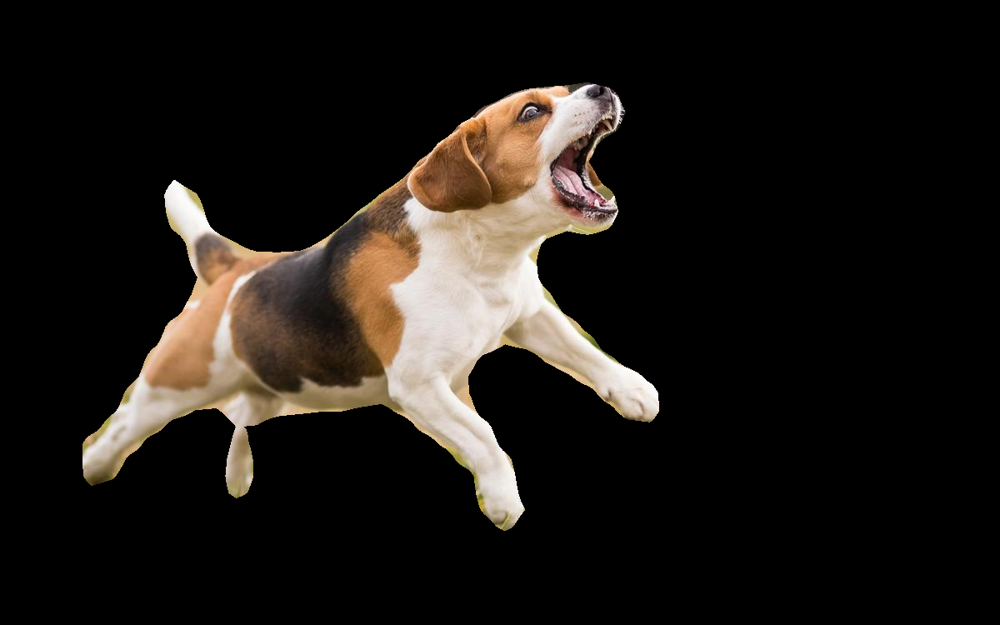
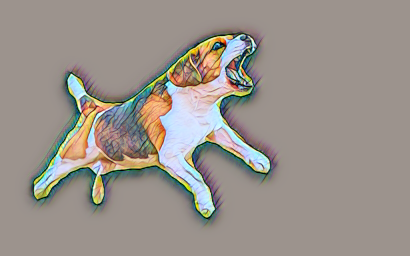
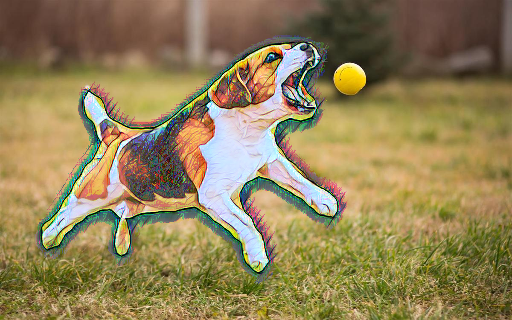

### Segmented Style Transfer

</img>
</img>
</img>
</img>

Selectively apply neural style transfer upon specific semantic segments within an image. Facilitated with instance segmentation and fast style transfer. Execute with `python segmented_style_transfer.py`. Pass `segment` index as argument into `PartialStyleTransfer`. 